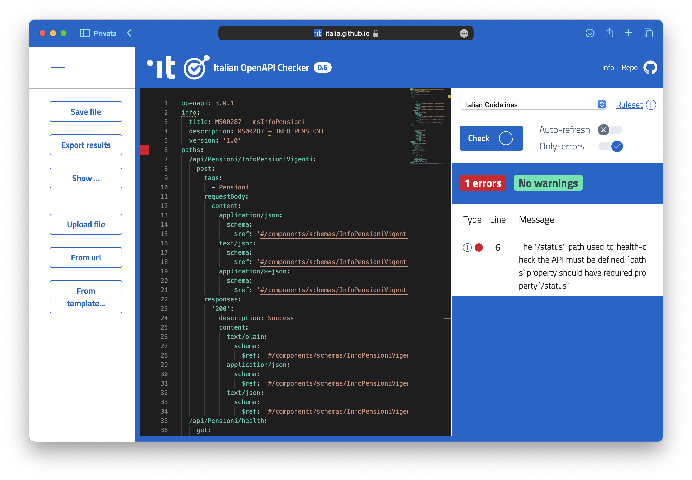
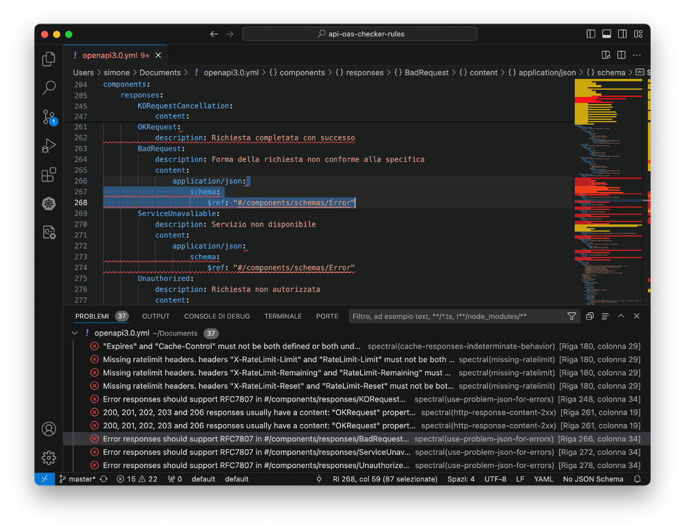

# Guida alla Validazione delle OpenAPI per l'Interoperabilità Tecnica della PA Italiana

## Obiettivo della Guida

Questa guida ha l'obiettivo di fornire le istruzioni necessarie per validare le interfacce OpenAPI affinché aderiscano alle regole del Modello di Interoperabilità Tecnica per la Pubblica Amministrazione (PA) Italiana.

Per maggiori informazioni sul modello, è possibile scaricare il documento [qui](https://www.agid.gov.it/sites/agid/files/2024-05/linee_guida_interoperabilit_tecnica_pa.pdf) e aprirlo con Adobe Reader per visualizzare gli allegati. L’allegato con le regole è intitolato **Raccomandazioni di implementazione**.

## Metodi di Validazione

## Premessa
Affinché un'interfaccia OpenAPI sia compliant con le prescrizioni del _Modello per l'Interoperabilità Tecnica per la PA_, è necessario che la validazione restituisca zero errori in seguito al controllo con le regole [spectral-modi.yml](https://github.com/italia/api-oas-checker-rules/releases/latest/download/spectral-modi.yml), anche note come **Italian Guidelines**.

## Indice dei Metodi di Validazione

1. 🌐 [Primo Metodo: il Sito Web](#primo-metodo-il-sito-web)
2. 🖥️ [Secondo Metodo: l'estensione per IDE](#secondo-metodo-lestensione-per-ide)
3. 💻 [Terzo Metodo: da Linea di Comando (CLI)](#terzo-metodo-da-linea-di-comando-cli)
4. ⚙️ [Quarto Metodo: GitHub Action](#quarto-metodo-github-action)

### Primo Metodo: il Sito Web

#### Italian OpenAPI Validation Checker

[**Italian OpenAPI Validation Checker**](https://italia.github.io/api-oas-checker/) è una web app che permette di validare le interfacce OpenAPI direttamente da browser, identificando tutti gli errori presenti.

Per eseguire la validazione, è sufficiente:
1. Aprire un file di specifica OpenAPI in un editor di testo
2. Copiare e incollare il contenuto all'interno del riquadro del sito.
3. Selezionare il set di regole _Italian Guidelines_ se non già selezionato.
2. Cliccare su **Validate**.



#### Importante

- Correggere obbligatoriamente gli errori segnalati in rosso.
- Correggere opzionalmente i warning segnalati in arancione.
- In grigio sono presenti suggerimenti utili, anche questi opzionali.

### Secondo Metodo: l'estensione per IDE

#### L'estensione

Spectral, lo strumento alla base del sito web, è disponibile anche come estensione per **Visual Studio Code** e altri IDE.

> **Che cos'è Spectral?**
> 
> Spectral è uno strumento di linting open-source progettato per la validazione, la formattazione e la pulizia dei file JSON e YAML. È particolarmente utile per la verifica delle specifiche OpenAPI, garantendo che aderiscono agli standard e alle best practices definite.
> 
> Per ulteriori informazioni, visita il sito ufficiale di [Spectral](https://stoplight.io/open-source/spectral/).

#### Installazione

È possibile scaricare l’estensione dallo store integrato nel proprio IDE di riferimento, ad esempio Visual Studio Code. L’estensione per quest'ultimo è scaricabile [qui](https://marketplace.visualstudio.com/items?itemName=stoplight.spectral).


#### Configurazione

Dalle impostazioni dell’estensione nell’IDE, è necessario configurare il file delle regole. Si può scegliere tra due opzioni:
1. Avere il file delle regole localmente sul proprio computer e inserire il relativo percorso.
2. Inserire l’URL remoto (es. GitHub) al file delle regole, come quello delle _Italian Guidelines_ [spectral-modi.yml](https://github.com/italia/api-oas-checker-rules/releases/latest/download/spectral-modi.yml).

Per gli altri file delle regole, è possibile far riferimento al [repository ufficiale](https://github.com/italia/api-oas-checker-rules/releases).


#### Funzionamento

L’estensione segnala in tempo reale gli errori e i warning rilevati nei file OpenAPI aperto (file .yaml, .yml o .json).



### Terzo Metodo: da Linea di Comando (CLI)

#### Linea di Comando (CLI)

Spectral è utilizzabile anche da linea di comando (CLI) per fare validazione massiva delle OpenAPI.

Su GitHub, a [questo link](https://github.com/stoplightio/spectral), è disponibile una guida per l’installazione di Spectral in locale, tramite npm (maggiori info [qui](https://www.npmjs.com/)) e yarn (maggiori info [qui](https://yarnpkg.com/)).


Per validare un file OpenAPI, utilizzare il seguente comando da terminale:

```sh
spectral lint percorso_file_openapi –e utf8 –D –f json –o percorso_file_output –r percorso_file_regole -v
```


#### Parametri del Comando

- `percorso_file_openapi`: il percorso al file contenente l’interfaccia OpenAPI da validare;
- `percorso_file_output`: il percorso al file JSON di output che conterrà tutti gli errori individuati;
- `percorso_file_regole`: il percorso al file delle regole per la validazione, anche remoto (come appunto le Italian Guidelines, [spectral-modi.yml](https://github.com/italia/api-oas-checker-rules/releases/latest/download/spectral-modi.yml)).

#### Tip

Togliendo il parametro `–D`, il tool restituirà in output anche i warning e i consigli per essere ancor più compliant alle best-practice per l’interoperabilità e allo standard OpenAPI 3.

Nel file di output, in formato JSON, è presente la lista di tutte le occorrenze in cui le regole sono state violate.


#### Alternativa con Docker

In alternativa, è possibile evitare l'installazione di Spectral usando Docker:

```sh
docker run --rm --entrypoint=sh \
     -v $(pwd)/api:/locale stoplight/spectral:5.9.1 \
     -c "spectral lint /locale/file_openapi –e utf8 –D –f json –o percorso_file_output –r percorso_file_regole -v"
```

### Quarto Metodo: GitHub Action

#### GitHub Action

È stata realizzata una GitHub Action facilmente integrabile che consente di effettuare la validazione delle interfacce OpenAPI con Spectral per ogni push e pull request su una repository. Questa soluzione automatizza il processo di validazione, garantendo che ogni modifica venga controllata in conformità con le regole stabilite.

#### Personalizzazione

È possibile personalizzare ulteriormente l’azione modificando, ad esempio, la cartella dove cercare le OpenAPI e i branch oggetto del linter. In questo modo, è possibile adattare l’azione alle specifiche esigenze del proprio progetto.

#### Esempio Funzionante

Al link [resources/github-action.yml](resources/github-action.yml) si trova un esempio già funzionante di GitHub Action. La Action scarica sempre l’ultimo ruleset pubblicato, assicurando che la validazione sia sempre aggiornata con le ultime regole disponibili. A valle dell'esecuzione, nella pagina di esecuzione è disponibile, in fondo, come da immagine, un archivio coi risultati dell'analisi di Spectral sugli eventuali file OpenAPI.


Speriamo che questa guida sia utile per garantire che le vostre interfacce OpenAPI rispettino gli standard richiesti per l'interoperabilità tecnica nella Pubblica Amministrazione Italiana. Buona validazione!
