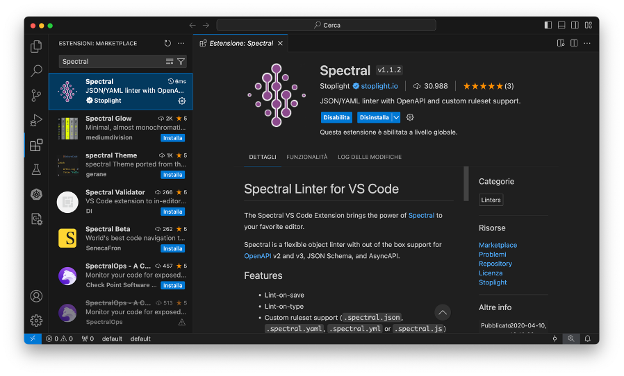
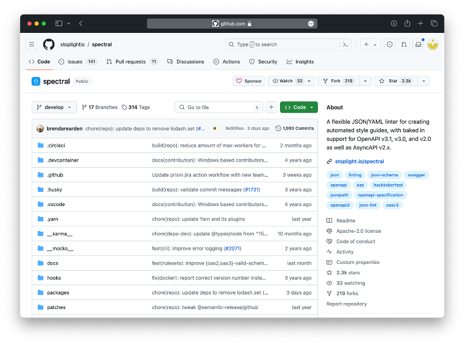
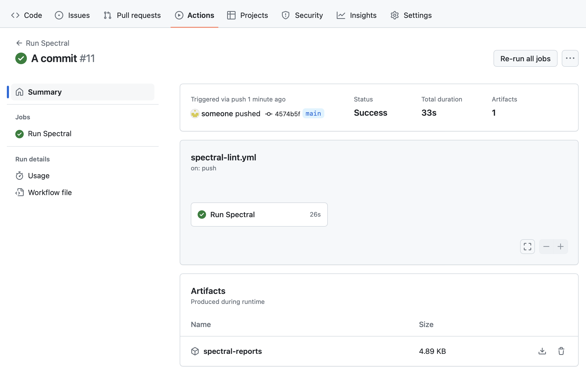

# Guide to OpenAPI Validation for Technical Interoperability of the Italian PA

## Objective of the Guide

This guide aims to provide the necessary instructions to validate OpenAPI interfaces to ensure they adhere to the rules of the Technical Interoperability Model for the Italian Public Administration (PA).

For more information on the model, you can download the document [here](https://www.agid.gov.it/sites/agid/files/2024-05/linee_guida_interoperabilit_tecnica_pa.pdf) and open it with Adobe Reader to view the attachments. The attachment with the rules is titled **Implementation Recommendations**.

## Validation Methods

## Premise
For an OpenAPI interface to be compliant with the _Technical Interoperability Model for the PA_, the validation must return zero errors after checking with the [Italian Guidelines](https://github.com/italia/api-oas-checker-rules/releases/latest/download/spectral-modi.yml), also known as **Italian Guidelines**.

## Index of Validation Methods

1. 🌐 [First Method: the Website](#first-method-the-website)
2. 🖥️ [Second Method: the IDE Extension](#second-method-the-ide-extension)
3. 💻 [Third Method: Command Line Interface (CLI)](#third-method-command-line-interface-cli)
4. ⚙️ [Fourth Method: GitHub Action](#fourth-method-github-action)

### First Method: the Website

#### Italian OpenAPI Validation Checker

[**Italian OpenAPI Validation Checker**](https://italia.github.io/api-oas-checker/) is a web app that allows validating OpenAPI interfaces directly from the browser, identifying all the errors present.

To perform the validation, simply:
1. Insert the content of an OpenAPI interface.
2. Select the _Italian Guidelines_ rule set if not already selected.
2. Click on **Validate**.


#### Important

- Mandatory to correct errors highlighted in red.
- Optionally correct warnings highlighted in orange.
- In gray, useful suggestions are also optional.

### Second Method: the IDE Extension

#### The Extension

Spectral, the tool behind the website, is also available as an extension for **Visual Studio Code** and other IDEs.

> **What is Spectral?**
> 
> Spectral is an open-source linting tool designed for validating, formatting, and cleaning JSON and YAML files. It is particularly useful for verifying OpenAPI specifications, ensuring they adhere to defined standards and best practices.
> 
> For more information, visit the official [Spectral](https://stoplight.io/open-source/spectral/) website.

#### Installation

You can download the extension from the integrated store in your preferred IDE, such as Visual Studio Code. The extension for the latter can be downloaded [here](https://marketplace.visualstudio.com/items?itemName=stoplight.spectral).



#### Configuration

From the extension settings in the IDE, you need to configure the rules file. You can choose between two options:
1. Have the rules file locally on your computer and enter the relevant path.
2. Enter the remote URL (e.g., GitHub) to the rules file, such as the Italian Guidelines at [spectral-modi.yml](https://github.com/italia/api-oas-checker-rules/releases/latest/download/spectral-modi.yml).

For other rules files, you can refer to the [official repository](https://github.com/italia/api-oas-checker-rules/releases).


#### Operation

The extension signals in real-time the errors and warnings detected in the open OpenAPI files (file .yaml, .yml, or .json).


### Third Method: Command Line Interface (CLI)

#### Command Line Interface (CLI)

Spectral can also be used from the command line (CLI) for massive validation of OpenAPI.

On GitHub, at [this link](https://github.com/stoplightio/spectral), a guide is available for installing Spectral locally, via npm (more info [here](https://www.npmjs.com/)) and yarn (more info [here](https://yarnpkg.com/)).



To validate an OpenAPI file, use the following command from the terminal:

```sh
spectral lint path_to_openapi_file –e utf8 –D –f json –o path_to_output_file –r path_to_rules_file -v
```


#### Command Parameters

- `path_to_openapi_file`: the path to the file containing the OpenAPI interface to validate;
- `path_to_output_file`: the path to the JSON output file that will contain all identified errors;
- `path_to_rules_file`: the path to the rules file for validation, also remote (such as the Italian Guidelines at [spectral-modi.yml](https://github.com/italia/api-oas-checker-rules/releases/latest/download/spectral-modi.yml)).

#### Tip

By removing the `–D` parameter, the tool will also return warnings and suggestions to be even more compliant with best practices for interoperability and the OpenAPI 3 standard.

In the output file, in JSON format, there is a list of all occurrences where the rules have been violated.


#### Alternative with Docker

Alternatively, you can avoid installing Spectral using Docker:

```sh
docker run --rm --entrypoint=sh \
     -v $(pwd)/api:/local stoplight/spectral:5.9.1 \
     -c "spectral lint /local/openapi_file –e utf8 –D –f json –o path_to_output_file –r path_to_rules_file -v"
```

### Fourth Method: GitHub Action

#### GitHub Action

A GitHub Action has been created that allows easy integration for validating OpenAPI interfaces with Spectral for every push and pull request on a repository. This solution automates the validation process, ensuring that every change is checked in accordance with the established rules.

#### Customization

It is possible to further customize the action by modifying, for example, the folder where to search for OpenAPIs and the branches subject to the linter. This way, you can adapt the action to the specific needs of your project.

#### Working Example

At the link [resources/github-action.yml](resources/github-action.yml) you can find a working example of GitHub Action. The Action always downloads the latest published ruleset, ensuring that the validation is always up-to-date with the latest available rules. After execution, at the bottom of the execution page, as shown in the image, an archive with the results of Spectral's analysis on the OpenAPI files, if any, is available.



We hope this guide is useful to ensure that your OpenAPI interfaces comply with the standards required for technical interoperability in the Italian Public Administration. Happy validation!
