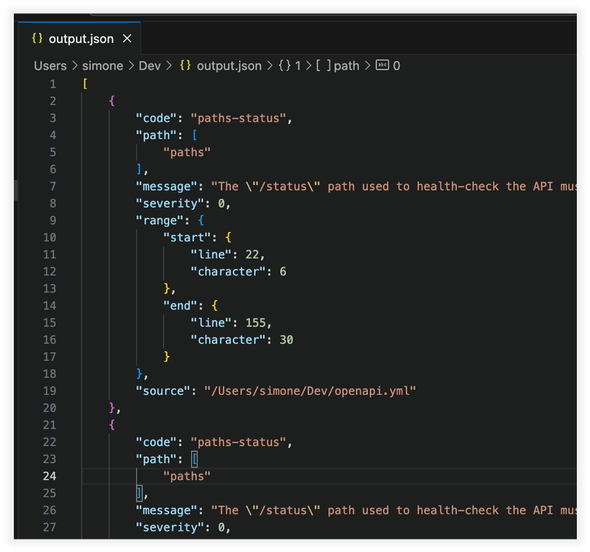

# Guide to Verifying OpenAPIs for Technical Interoperability of the Italian PA

## Guide Objective

This guide aims to provide the necessary instructions to verify OpenAPI interfaces to ensure they adhere to the rules of the Technical Interoperability Model for the Italian Public Administration (PA).

For more information on the model, you can download the document [here](https://www.agid.gov.it/sites/agid/files/2024-05/linee_guida_interoperabilit_tecnica_pa.pdf) and open it with Adobe Reader to view the attachments. The attachment with the rules is titled **Implementation Recommendations**.

## Verification Methods

## Premise
To ensure an OpenAPI interface is compliant with the requirements of the _Model for Technical Interoperability for the PA_, the verification must return zero errors after checking with the rules [spectral-modi.yml](https://github.com/italia/api-oas-checker-rules/releases/latest/download/spectral-modi.yml), also known as **Italian Guidelines**.

## Index of Verification Methods

1. 🌐 [First Method: Website](#first-method-website)
2. 🖥️ [Second Method: IDE Extension](#second-method-ide-extension)
3. 💻 [Third Method: Command Line (CLI)](#third-method-command-line-cli)
4. ⚙️ [Fourth Method: GitHub Action](#fourth-method-github-action)

### First Method: Website

#### Italian OpenAPI Checker

[**Italian OpenAPI Checker**](https://italia.github.io/api-oas-checker/) is a web app that allows you to verify OpenAPI interfaces directly from the browser, identifying all the present errors.

To perform the verification, simply:
1. Open an OpenAPI specification file in a text editor
2. Copy and paste the content into the site's box.
3. Select the _Italian Guidelines_ ruleset if not already selected.
4. Click on **Check**.


#### Important

- Mandatory to correct the errors marked in red.
- Optionally correct the warnings marked in orange.
- Gray suggestions are useful and also optional.

### Second Method: IDE Extension

#### The Extension

Spectral, the tool behind the website, is also available as an extension for **Visual Studio Code** and other IDEs.

> **What is Spectral?**
> 
> Spectral is an open-source linting tool designed for the verification, formatting, and cleaning of JSON and YAML files. It is particularly useful for verifying OpenAPI specifications, ensuring they adhere to defined standards and best practices.
> 
> For more information, visit the official [Spectral](https://stoplight.io/open-source/spectral/) website.

#### Installation

The extension can be downloaded from the integrated store in your IDE, such as Visual Studio Code. The extension for the latter is available [here](https://marketplace.visualstudio.com/items?itemName=stoplight.spectral).


#### Configuration

From the extension settings in the IDE, you need to configure the rules file. You can choose between two options:
1. Have the rules file locally on your computer and enter the respective path.
2. Enter the remote URL (e.g., GitHub) for the rules file, such as the _Italian Guidelines_ [spectral-modi.yml](https://github.com/italia/api-oas-checker-rules/releases/latest/download/spectral-modi.yml).

For other rules files, refer to the [official repository](https://github.com/italia/api-oas-checker-rules/releases).


#### Functioning

The extension reports errors and warnings detected in real-time in the open OpenAPI file (file .yaml, .yml, or .json).


### Third Method: Command Line (CLI)

#### Command Line (CLI)

Spectral can also be used from the command line (CLI) for bulk verification of OpenAPIs.

On GitHub, at [this link](https://github.com/stoplightio/spectral), there is a guide for installing Spectral locally via npm (more info [here](https://www.npmjs.com/)) and yarn (more info [here](https://yarnpkg.com/)).


To verify an OpenAPI file, use the following command in the terminal:

```sh
spectral lint file_path_openapi\
     –e utf8\
     –D\
     –f json\
     –o file_path_output\
     –r file_path_rules\
     -v
```


#### Command Parameters

- `file_path_openapi`: the path to the file containing the OpenAPI interface to be verified;
- `file_path_output`: the path to the JSON output file that will contain all identified errors;
- `file_path_rules`: the path to the rules file for verification, also remote (such as the Italian Guidelines, [spectral-modi.yml](https://github.com/italia/api-oas-checker-rules/releases/latest/download/spectral-modi.yml)).

#### Tip

By removing the `–D` parameter, the tool will also output warnings and suggestions to be even more compliant with interoperability best practices and the OpenAPI 3 standard.

The JSON output file contains a list of all instances where the rules have been violated.



#### Alternative with Docker

Alternatively, you can avoid installing Spectral by using Docker:

```sh
docker run\
     --rm\
     --entrypoint=sh\
     -v $(pwd)/api:/locale\
     stoplight/spectral:5.9.1\
     -c "spectral lint /locale/file_openapi –e utf8 –D –f json –o percorso_file_output –r percorso_file_regole -v"
```

### Fourth Method: GitHub Action

#### GitHub Action

A GitHub Action has been created that is easily integrable and allows verifying OpenAPI interfaces with Spectral for every push and pull request on a repository. This solution automates the verification process, ensuring that every change is checked in accordance with the established rules.

#### Customization

The action can be further customized by modifying, for example, the folder where to look for OpenAPIs and the branches subject to the linter. This way, the action can be adapted to the specific needs of your project.

#### Working Example

At the link [resources/github-action.yml](resources/github-action.yml), there is a fully working example of a GitHub Action. The Action always downloads the latest published ruleset, ensuring that the verification is always up-to-date with the latest available rules. At the end of the execution, at the bottom of the execution page, there is an archive with the results of the Spectral analysis on the potential OpenAPI files.


We hope this guide is useful to ensure your OpenAPI interfaces meet the required standards for technical interoperability in the Italian Public Administration. Happy verifying!
